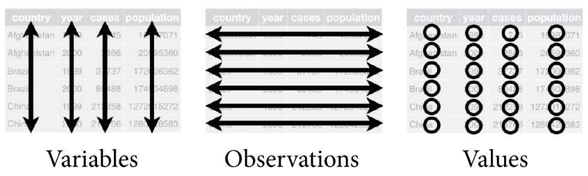
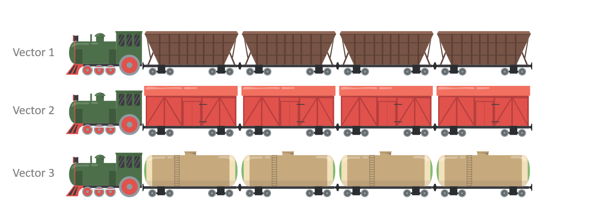
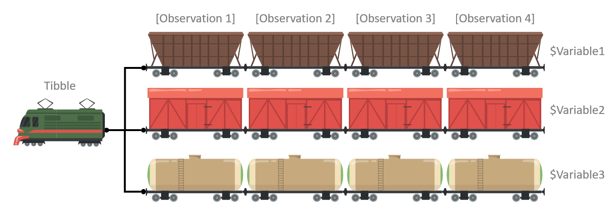

::: {.my-title}
# [Statistical Methods]{.blue}
Data Frames / Files / Exploration

::: {.my-grey}
[Unit  | Chapter ]{}<br />
[Lecture ]{}
:::

::: {.my-attrib}

:::

{.absolute bottom=30 right=0 width="400"}
:::

## Roadmap: More Programming

::: {.columns .pv4}

::: {.column width="60%"}
1. Data Frames
  
2. Data Files

3. Data Exploration
:::

::: {.column .tc .pv4 width="40%"}

:::

:::

# Data Frames

## Tidy Data {.fs70}

::: {.columns .pv4}
::: {.column width="60%"}
- There are many ways to store data

::: {.fragment .mt1}
- We will be learning the [tidy data]{.b .blue} format
    - Data should be *rectangular*
    - Each [variable]{.green} has its own column
    - Each [observation]{.green} has its own row
    - Each [value]{.green} has its own cell
:::

::: {.fragment .mt1}

:::

:::

::: {.column .tc .pv5 width="40%"}

:::
:::

## Other Data Advice {.fs70}

::: {.columns .pv4}
::: {.column width="60%"}
-   [Name all variables]{.b .blue} in the first row
    -   This is called a [header row]{.b .green}
    
::: {.fragment .mt1}
-   [Avoid merged cells]{.b .blue} for data storage
    -   These are okay for communication
:::

::: {.fragment .mt1}
-   [Avoid empty cells]{.b .blue} whenever possible
    -   Mark [missing data]{.b .green} as `NA`
:::

::: {.fragment .mt1}
-   [Avoid formatting-as-data]{.b .blue} for storage
    -   e.g., non-redundant color-coding
:::
:::

::: {.column .tc .pv5 width="40%"}

:::
:::

## Tidying Example 1 {.fs70}

::: {.columns .pv4}
::: {.column width="45%"}
#### Not Tidy
<table class="table-bad" width="100%">
  <tbody>
  <tr>
    <td>Name</td>
    <td>Ann</td>
    <td>Bob</td>
    <td>Cat</td>
    <td>Dom</td>
  </tr>
  <tr>
    <td>Age</td>
    <td>13</td>
    <td>10</td>
    <td>11</td>
    <td>11</td>
  </tr>
  <tr>
    <td>Weight</td>
    <td>56.4</td>
    <td>46.8</td>
    <td>41.3</td>
    <td>43.3</td>
  </tr>
  </tbody>
</table>

::: {.fragment .mt1 .pv4}
❌ Here, each row is a variable and each column is an observation.
:::
:::

::: {.column width="10%"}
:::

::: {.column width="45%"}
::: {.fragment}
#### Tidy
<table class="table-good" width="100%">
  <tbody>
  <tr>
    <td>Name</td>
    <td>Age</td>
    <td>Weight</td>
  </tr>
  <tr>
    <td>Ann</td>
    <td>13</td>
    <td>56.4</td>
  </tr>
  <tr>
    <td>Bob</td>
    <td>10</td>
    <td>46.8</td>
  </tr>
  <tr>
    <td>Cat</td>
    <td>11</td>
    <td>41.3</td>
  </tr>
  <tr>
    <td>Dom</td>
    <td>11</td>
    <td>43.3</td>
  </tr>
  </tbody>
</table>
::: {.pv4}
✔️ Here, each column is a variable and each row is an observation.
:::
:::
:::
:::


## Tidying Example 2 {.fs70}

::: {.columns .pv4}
::: {.column width="45%"}
#### Not Tidy
<table class="table-bad" width="100%">
  <tbody>
  <tr>
    <td>Names:</td>
    <td>Ann</td>
    <td>Bob</td>
    <td>Cat</td>
    <td>Dom</td>
  </tr>
  <tr>
    <td>Age</td>
    <td>Weight</td>
    <td></td>
    <td></td>
    <td></td>
  </tr>
  <tr>
    <td>13</td>
    <td>56.4</td>
    <td></td>
    <td></td>
    <td></td>
  </tr>
  <tr>
    <td>10</td>
    <td>46.8</td>
    <td></td>
    <td></td>
    <td></td>
  </tr>
  <tr>
    <td>11</td>
    <td>41.3</td>
    <td></td>
    <td></td>
    <td></td>
  </tr>
  <tr>
    <td>11</td>
    <td>43.3</td>
    <td></td>
    <td></td>
    <td></td>
  </tr>
  </tbody>
</table>

::: {.fragment .mt1 .pv4}
❌ Here, we have data that is not rectangular because the Names variable has its own row.
:::
:::

::: {.column width="10%"}
:::

::: {.column width="45%"}
::: {.fragment}
#### Tidy
<table class="table-good" width="100%">
  <tbody>
  <tr>
    <td>Name</td>
    <td>Age</td>
    <td>Weight</td>
  </tr>
  <tr>
    <td>Ann</td>
    <td>13</td>
    <td>56.4</td>
  </tr>
  <tr>
    <td>Bob</td>
    <td>10</td>
    <td>46.8</td>
  </tr>
  <tr>
    <td>Cat</td>
    <td>11</td>
    <td>41.3</td>
  </tr>
  <tr>
    <td>Dom</td>
    <td>11</td>
    <td>43.3</td>
  </tr>
  </tbody>
</table>

::: {.pv4}
✔️ Here, we have made the data rectangular by moving the Names variable to its own column.
:::
:::
:::
:::


## Tidying Example 3 {.fs70}

::: {.columns .pv4}
::: {.column width="45%"}
#### Not Tidy
<table class="table-bad table-small" width="100%">
  <tbody>
  <tr>
    <td>country</td>
    <td>year</td>
    <td>cases / population</td>
  </tr>
  <tr>
    <td rowspan=2>Afghanistan</td>
    <td>1999</td>
    <td>NA / 19987071</td>
  </tr>
  <tr>
    <td>2000</td>
    <td>2666 / 20595360</td>
  </tr>
  <tr>
    <td rowspan=2>Brazil</td>
    <td>1999</td>
    <td>37737 / 172006362</td>
  </tr>
  <tr>
    <td>2000</td>
    <td>80488 / 174504898</td>
  </tr>
  <tr>
    <td rowspan=2>China</td>
    <td>1999</td>
    <td>212258 / 1272915272</td>
  </tr>
  <tr>
    <td>2000</td>
    <td>213766 / 1280428583</td>
  </tr>
  </tbody>
</table>

::: {.fragment .mt1 .pv4}
❌ Here, we have merged cells and two values stored in a single cell.
:::
:::

::: {.column width="10%"}
:::

::: {.column width="45%"}
::: {.fragment}
#### Tidy
<table class="table-good table-small" width="100%">
  <tbody>
  <tr>
    <td>country</td>
    <td>year</td>
    <td>cases</td>
    <td>population</td>
  </tr>
  <tr>
    <td>Afghanistan</td>
    <td>1999</td>
    <td>NA</td>
    <td>19987071</td>
  </tr>
  <tr>
    <td>Afghanistan</td>
    <td>2000</td>
    <td>2666</td>
    <td>20595360</td>
  </tr>
  <tr>
    <td>Brazil</td>
    <td>1999</td>
    <td>37737</td>
    <td>172006362</td>
  </tr>
  <tr>
    <td>Brazil</td>
    <td>2000</td>
    <td>80488</td>
    <td>174504898</td>
  </tr>
  <tr>
    <td>China</td>
    <td>1999</td>
    <td>212258</td>
    <td>1272915272</td>
  </tr>
  <tr>
    <td>China</td>
    <td>2000</td>
    <td>213766</td>
    <td>1280428583</td>
  </tr>
  </tbody>
</table>
::: {.pv4}
✔️ Here, we have un-merged the countries and separated the cases and populations variables into columns.
:::
:::
:::
:::

## Tibbles {.fs70}

::: {.columns .pv4}
::: {.column width="60%"}
-   R works particularly well with [tidy data]{.b .green}

::: {.fragment .mt1}
-   We store tidy data in [data frames]{.b .green} or [tibbles]{.b .blue}
    -   Tibbles are just fancier data frames<br />
        (i.e., they have a few extra features)
:::

::: {.fragment .mt1}
-   To use tibbles, we need the [tidyverse]{.b .blue} package
:::

::: {.fragment .mt1}
-   Tibbles are constructed from one or more vectors
    -   The vectors must have the [same length]{.b .green}
    -   They can contain [different types]{.b .green} of data
:::
:::

::: {.column .tc .pv5 width="40%"}

:::
:::


## Parallel Vectors {.fs70}



::: {.tc .pv4}
We start with three separate vector objects that all have the same length.

We set it up so that the $n$-th car in each train corresponds to the same observation.
:::


## Tibble {.fs70}



::: {.tc .pv4}
Then we combine the vectors into a single tibble (or data frame) object.

Now, as the tibble moves around, the variables always stay together.
:::


## Tibbles Live Coding

```{r}
#| echo: true
#| eval: false
#| error: true
#| code-line-numbers: false

# SETUP: Install and load the tidyverse package

# Extras pane > Packages tab > Install

library(tidyverse)

# ==============================================================================

# LESSON: Create a tibble from vectors

x <- c(10, 20, 30, 40)
x

y <- x * 2 - 4
y

my_tibble <- tibble(x, y)
my_tibble

# ==============================================================================

# USECASE: You can mix different types of vectors in a single tibble

first_names <- c("Adam", "Billy", "Caitlyn", "Debra")

age_years <- c(12, 13, 10, NA)

guests <- tibble(first_names, age_years)
guests

# ==============================================================================

# TIP: To save time, you can also create the vectors in the tibble call

gradebook <- tibble(
  grade = c(95, 83, 90, 76),
  letter = c("a", "b", "a-", "c")
)
gradebook

# ==============================================================================

# PITFALL: Don't try to combine tibbles with different lengths

y <- c(1, 2, 3)
x <- c("a", "b")

tibble(y, x) #error

# ==============================================================================

# LESSON: You can "extract" a vector from a tibble using $

mytibble <- tibble(x = c(1, 2, 3, 4, 5), y = "test")

mytibble$x

mytibble$y

# ==============================================================================

# PITFALL: Don't try to extract a vector that doesn't exist

mytibble$z #error

# ==============================================================================

# USECASE: Get information about a tibble

dim(gradebook)

colnames(gradebook)
```

## Data Files {.fs70}

::: {.columns .pv4}
::: {.column width="60%"}
-   Data is usually stored in [data files]{.b .green}
    -   Importing files into R is called [reading]{.b .blue}
    -   Exporting files from R is called [writing]{.b .blue}

::: {.fragment .mt1}
-   A convenient data file type is a CSV
    -   This stands for [comma-separated values]{.b .green}
    -   A CSV file is easy to share with other people
:::

::: {.fragment .mt1}
-   The [tidyverse]{.b .green} package can read/write CSVs
    -   Other packages can read/write other types
        (e.g., *readxl*, *haven*, *rio*, *googlesheets4*)
:::
:::

::: {.column .tc .pv5 width="40%"}

:::
:::


## Data Files Live Coding

```{r}
#| echo: true
#| eval: false
#| error: true
#| code-line-numbers: false

# SETUP: Load the tidyverse package (if you haven't yet)

library(tidyverse)

# ==============================================================================

# SETUP: Download gradebook.csv from the course website into your project folder

# NOTE: You can see the file in Extras pane > Files tab.
# You can open it in another program (e.g., Microsoft Excel).

# ==============================================================================

# USECASE: Read in a file containing data

old_gradebook <- read_csv("gradebook.csv")
old_gradebook

# NOTE: read_csv() will examine and guess the data type of each variable.
# You can tell it the data type of each variable, but that is more advanced.

# ==============================================================================

# USECASE: Tell R which codes were used to denote missing values

old_gradebook <- read_csv("gradebook.csv", na = "?")
old_gradebook

# ==============================================================================

# USE CASE: Reading in other types of data

# The readxl and googlesheets4 packages work with spreadsheets
# The haven package works with files from SPSS, SAS, and STATA
# The rio package tries to detect the type and read in anything
```


# Data Exploration

## Data Verification {.fs70}

::: {.columns .pv4}
::: {.column width="60%"}
-   It's always a good idea to start with [verification]{.b .blue}

::: {.fragment .mt1}
-   Check that your variables are the [correct type]{.b .green}
    -   Configure your [factors]{.b .green}' levels and labels
    -   Establish ordinal factors' ordering
    -   Explicitly set your [missing values]{.b .green} to NA
:::

::: {.fragment .mt1}
-   Check variables' [extrema]{.b .green} and [distributions]{.b .green}
    -   Check for erroneous and outlying values
    -   Check the shape of continuous distributions
    -   Check the overlap of categorical levels
:::
:::

::: {.column .tc .pv5 width="40%"}

:::
:::

## Data Verification Live Coding

```{r}
#| echo: true
#| eval: false
#| error: true
#| code-line-numbers: false
#| replace_path: ["../../data/", ""]

# SETUP: We will use the tidyverse and easystats packages

library(tidyverse)
library(easystats)

# ==============================================================================

# SETUP: We will use the salaries data and configure its factors

salaries <- read_csv("../../data/salaries0.csv")
salaries

salaries$rank <- factor(salaries$rank, levels = c(1, 2, 3), 
                        labels = c("Assistant", "Associate", "Full"))

salaries$discipline <- factor(salaries$discipline, levels = c(1, 2), 
                              labels = c("Applied", "Theoretical"))

salaries$sex <- factor(salaries$sex, levels = c(1, 2), 
                       labels = c("Female", "Male"))

salaries
write_csv(salaries, "salaries.csv")

# ==============================================================================

# LESSON: Then check the summary statistics for problems

summary(salaries)

# ==============================================================================

# LESSON: Describe the distribution of continuous variables

describe_distribution(salaries, salary)
describe_distribution(salaries)

# ==============================================================================

# LESSON: Describe the distributions of discrete variables / factors

data_tabulate(salaries, rank)
data_tabulate(salaries, is.factor)
```

## Data Visualization {.fs70}

::: {.columns .pv4}
::: {.column width="60%"}
-   [Variable distributions]{.b .blue} are critical in data analysis
    -   What are the most and least [common values]{.b .green}?
    -   What are the [extrema]{.b .green} (min and max values)?
    -   Are there any [outliers]{.b .green} or impossible values?
    -   How much [spread]{.b .green} is there in the variable?
    -   What [shape]{.b .green} does the distribution take?

::: {.fragment .mt1}
-   Distributions describe a single variable's [variation]{.b .green}
    -   We also visualize many variables' [covariation]{.b .blue}
:::
:::

::: {.column .tc .pv5 width="40%"}

:::
:::

## Data Visualization Live Coding

```{r}
#| echo: true
#| eval: false
#| error: true
#| code-line-numbers: false
#| replace_path: ["../../data/", ""]

# PREP: We will need the tidyverse package and some example data

library(tidyverse)

salaries <- read_csv("../../data/salaries.csv")

# ==============================================================================

# USECASE: Visualize the variation of a discrete variable / factor

qplot(x = rank, data = salaries, geom = "bar")

qplot(x = discipline, data = salaries, geom = "bar")

# ==============================================================================

# USECASE: Visualize the variation of a continuous variable

qplot(x = yrs.since.phd, data = salaries, geom = "histogram")

qplot(x = yrs.since.phd, data = salaries, geom = "boxplot")

qplot(x = salary, data = salaries, geom = "histogram")

qplot(x = salary, data = salaries, geom = "boxplot")

# ==============================================================================

# USECASE: Visualize the covariation of two continuous variables

qplot(x = yrs.since.phd, y = salary, data = salaries, geom = "point")

# ==============================================================================

# USECASE: Visualize the covariation of two discrete variables

qplot(x = rank, y = discipline, data = salaries, geom = "jitter")

qplot(x = rank, fill = discipline, data = salaries, geom = "bar")

# ==============================================================================

# USECASE: Visualize the covariation of a discrete and a continuous variable

qplot(x = salary, y = rank, data = salaries, geom = "boxplot")

qplot(x = salary, y = rank, data = salaries, geom = "violin")
```
