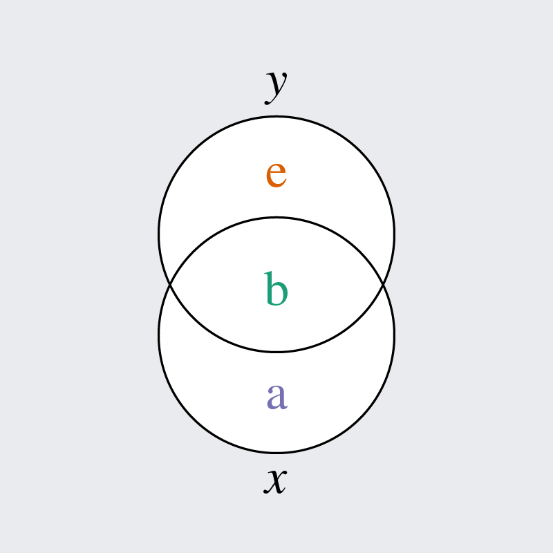
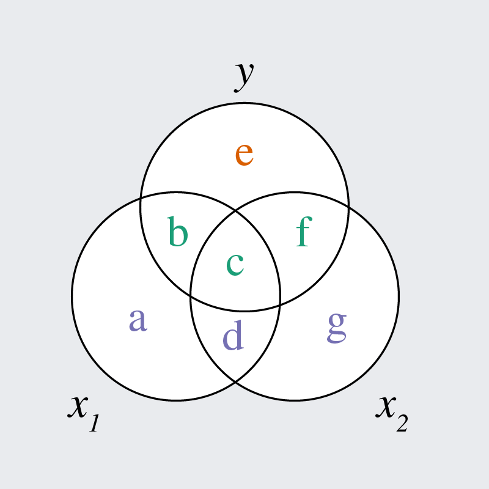

::: {.my-title}
# [Statistical Methods]{.blue}
Multiple Regression / Partial Effects

::: {.my-grey}
[ | Course ]{}<br />
[ | Lecture ]{}
:::

::: {.my-attrib}

:::

{.absolute bottom=30 right=0 width="400"}
:::

```{r setup}
#| echo: false
#| message: false

library(tidyverse)
library(easystats)
library(patchwork)
mytheme <- function(sz = 30) {
  theme_gray(base_size = sz) + 
  theme(panel.grid.minor = element_blank())
}
# Make mytheme the default rather than relying on every plot remembering
# `+ mytheme`. Plots built by other packages -- plot(), check_model(),
# modelbased -- never get a manual `+ mytheme` and were rendering at
# ggplot's 11pt default, which reads as tiny next to the 40px slide text.
theme_set(mytheme())
```


# Shared Variance

## Multiple regression

We often predict outcome variables using [multiple predictors]{.b .blue}

1. This will usually yield [better predictions]{.b .green} and higher $R^2$

2. It will also let us isolate the predictors' [unique contributions]{.b .green}
    + When predictors are correlated, they have redundancy
    
::: {.fragment}
- *Example:* Predict salary from productivity and seniority
    + Having more pubs and more years both increase salary
    + However, these predictors are positively correlated
    + What is the *unique* contribution of each predictor?
    
:::

## Multiple regression

- Let's say we want to predict $y$ from $x_1$ and $x_2$

- We can extend our regression equation with another slope

$$\hat{y} = b_0 + b_1x_1 + b_2x_2$$

- $b_1$ is related to the correlation between $x_1$ and $y$

- $b_2$ is related to the correlation between $x_2$ and $y$

:::{.fragment}
- We must account for any correlation between $x_1$ and $x_2$!
:::

## Two Types of Effects

[Zero-order effects]{.b .blue}

- Fit a separate simple regression model for each predictor

$$\text{M1: }\hat{y} = b_0 + b_1x_1 \qquad\quad \text{M2: }\hat{y} = b_0 + b_1x_2$$

- Interpretation of the $b_1$ slope from $\text{M1}$:<br>
the *total* relationship between $x_1$ and $y$ (ignoring $x_2$)

- Interpretation of the $b_1$ slope from $\text{M2}$:<br>
the *total* relationship between $x_2$ and $y$ (ignoring $x_1$)

## Two Types of Effects

[Partial effects]{.b .blue}

- Fit a single multiple regression model with all predictors:

$$\text{M3: }\hat{y} = b_0 + b_1x_1 + b_2x_2$$

- Interpretation of the $b_1$ slope from $\text{M3}$:<br>
the *unique* relationship between $x_1$ and $y$ (controlling $x_2$)
- Interpretation of the $b_2$ slope from $\text{M3}$:<br>
the *unique* relationship between $x_2$ and $y$ (controlling $x_1$)


## Controlling predictors

- What does it mean to statistically "control" (for) a predictor?

::: {.fragment}
+ **What is the relationship between $x_1$ and $y$ if we hold $x_2$ at a constant value?** *e.g., What is the salary difference between prof A (10 pubs, 10 years) and prof B (10 pubs, 11 years)?*

:::

::: {.fragment}
+ **If we already know $x_2$, how much does learning $x_1$ change our prediction of $y$?** *e.g., how much does learning that prof C has 20 pubs change our prediction of their salary if we already knew they have 15 years of seniority?*

:::

## Venn diagram for simple regression {.fs70}

::: {.columns}
::: {.column}

$$y_i = b_0 + b_1x_i + e_i$$


Each oval is one variable's **variance**

Two oval's overlap is their **covariance**

::: {.pv2}
<span style="color:#7570b3;font-weight:bold;">a</span> is the variance in $x$ unrelated to $y$

<span style="color:#1b9e77;font-weight:bold;">b</span> is the variance shared by $x$ and $y$

<span style="color:#d95f02;font-weight:bold;">e</span> is the variance in $y$ unrelated to $x$
:::

::: {.fragment .pv2}
$b_1$ represents <span style="color:#1b9e77;font-weight:bold;">b</span>

$R^2$ represents <span style="color:#1b9e77;font-weight:bold;">b</span> / (<span style="color:#1b9e77;font-weight:bold;">b</span> + <span style="color:#d95f02;font-weight:bold;">e</span>)
:::

:::
::: {.column}

:::
:::

## Venn diagram for two predictors {.fs70}

::: {.columns}
::: {.column}

$$y_i = b_0 + b_1x_{1i} + b_2x_{2i} + e_i$$

::: {.pv2}
<span style="color:#7570b3;font-weight:bold;">a</span> is the var in $x_1$ unrelated to $y$ or $x_2$

<span style="color:#1b9e77;font-weight:bold;">b</span> is the var shared by $x1$ and $y$ (not $x_2$)

<span style="color:#1b9e77;font-weight:bold;">c</span> is the var shared by $x_1$, $x_2$, and $y$

<span style="color:#7570b3;font-weight:bold;">d</span> is the var shared by $x_1$ and $x_2$ (not $y$)

<span style="color:#d95f02;font-weight:bold;">e</span> is the var in $y$ unrelated to $x_1$ or $x_2$

<span style="color:#1b9e77;font-weight:bold;">f</span> is the var shared by $x_2$ and $y$ (not $x_1$)

<span style="color:#7570b3;font-weight:bold;">g</span> is the var in $x_2$ unrelated to $x_1$ or $y$

:::

:::
::: {.column}

:::
:::


## Zero-order effect of $x_1$ {.fs70}

::: {.columns}
::: {.column}

$$y_i = b_0 + b_1x_{1i} + e_i$$

::: {.pv2}
If we regress $y$ on $x_1$ only, we get the zero-order (i.e., total) effect of $x_1$

$b_1$ represents <span style="color:#1b9e77;font-weight:bold;">b</span> + <span style="color:#1b9e77;font-weight:bold;">c</span>

$e_i$ represents <span style="color:#d95f02;font-weight:bold;">e</span> + <span style="color:#1b9e77;font-weight:bold;">f</span>

$R^2$ represents (<span style="color:#1b9e77;font-weight:bold;">b</span> + <span style="color:#1b9e77;font-weight:bold;">c</span>) / (<span style="color:#1b9e77;font-weight:bold;">b</span> + <span style="color:#1b9e77;font-weight:bold;">c</span> + <span style="color:#d95f02;font-weight:bold;">e</span> + <span style="color:#1b9e77;font-weight:bold;">f</span>)
:::

:::
::: {.column}

:::
:::


## Zero-order effect of $x_2$ {.fs70}

::: {.columns}
::: {.column}

$$y_i = b_0 + b_1x_{2i} + e_i$$

::: {.pv2}
If we regress $y$ on $x_2$ only, we get the zero-order (i.e., total) effect of $x_2$

$b_1$ represents <span style="color:#1b9e77;font-weight:bold;">c</span> + <span style="color:#1b9e77;font-weight:bold;">f</span>

$e_i$ represents <span style="color:#d95f02;font-weight:bold;">e</span> + <span style="color:#1b9e77;font-weight:bold;">b</span>

$R^2$ represents (<span style="color:#1b9e77;font-weight:bold;">c</span> + <span style="color:#1b9e77;font-weight:bold;">f</span>) / (<span style="color:#1b9e77;font-weight:bold;">c</span> + <span style="color:#1b9e77;font-weight:bold;">f</span> + <span style="color:#d95f02;font-weight:bold;">e</span> + <span style="color:#1b9e77;font-weight:bold;">b</span>)
:::

:::
::: {.column}

:::
:::

## Partial effects of $x_1$ and $x_2$ {.fs70}

::: {.columns}
::: {.column}

$$y_i = b_0 + b_1x_{1i} + b_2x_{2i} + e_i$$

::: {.pv2}
If we regress $y$ on both $x_1$ and $x_2$, we get their partial (i.e., unique) effects

$b_1$ represents <span style="color:#1b9e77;font-weight:bold;">b</span> only

$b_2$ represents <span style="color:#1b9e77;font-weight:bold;">f</span> only

$e_i$ represents <span style="color:#d95f02;font-weight:bold;">e</span> only

$R^2$ represents (<span style="color:#1b9e77;font-weight:bold;">b</span> + <span style="color:#1b9e77;font-weight:bold;">c</span> + <span style="color:#1b9e77;font-weight:bold;">f</span>) / (<span style="color:#1b9e77;font-weight:bold;">b</span> + <span style="color:#1b9e77;font-weight:bold;">c</span> + <span style="color:#1b9e77;font-weight:bold;">f</span> + <span style="color:#d95f02;font-weight:bold;">e</span>)

<span style="color:#1b9e77;font-weight:bold;">c</span> is included in $R^2$ but neither slope
:::

:::
::: {.column}

:::
:::

## Collinearity {.fs70}

::: {.columns}
::: {.column}

$$y_i = b_0 + b_1x_{1i} + b_2x_{2i} + e_i$$

::: {.pv2}
If $x_1$ and $x_2$ are highly correlated, then <span style="color:#1b9e77;font-weight:bold;">c</span> will be large and <span style="color:#1b9e77;font-weight:bold;">b</span> and <span style="color:#1b9e77;font-weight:bold;">f</span> may be small

Small slopes may lead you to conclude that $x_1$ and $x_2$ are not related to $y$

But this isn't quite right... it's just that they don't *uniquely* explain $y$ (rather, it is their overlap/shared variance that does)

So check zero-order *and* partial effects
:::

:::
::: {.column}

:::
:::

::: {.footer}
We will return to talk about collinearity more in a future lecture.
:::

# Multiple Regression

## Standardized partial effects {.fs70}

- The relationships are clearer if we start with *standardized* slopes first

$$\hat{y}_i^{(z)} = \beta_1x_{1i}^{(z)} + \beta_2x_{2i}^{(z)}$$

- We want to find the $\beta$ values that minimize the squared residuals

::: {.columns}
::: {.column}
$$\beta_1 = \frac{r(y,x_1)-r(y,x_2)r(x_1,x_2)}{1-r(x_1,x_2)^2}$$
:::
::: {.column}
$$\beta_2 = \frac{r(y,x_2)-r(y,x_1)r(x_1,x_2)}{1-r(x_1,x_2)^2}$$
:::
:::

- We start with the zero-order correlation we want to partialize (i.e., that between the predictor and outcome) and then remove the redundant/shared variance

::: {.footer}
Note that we omit $\beta_0$ because it is always zero.
:::

## Unstandardized partial effects

- To unstandardize the partial effects, we multiply by SD ratios

::: {.columns}
::: {.column}
$$b_1 = \beta_1\frac{s_y}{s_{x1}}$$
:::
::: {.column}
$$b_2 = \beta_2\frac{s_y}{s_{x2}}$$
:::
:::

- To calculate the unstandardized intercept, we can do...

$$b_0 = \bar{y} - b_1\bar{x}_1 - b_2\bar{x}_2$$

## Example data

```{r}
#| echo: true
#| collapse: true
#| message: false
#| replace_path: ["../../data/", ""]

library(tidyverse)
library(easystats)
yearspubs <- read_csv("../../data/yearspubs.csv")
yearspubs
```

## Zero-order correlations

```{r}
#| echo: true
#| collapse: true

y <- yearspubs$salary
x1 <- yearspubs$n_pubs
x2 <- yearspubs$yrs_since

r_y1 <- cor(y, x1)
r_y1

r_y2 <- cor(y, x2)
r_y2

r_12 <- cor(x1, x2)
r_12
```

## Zero-order effects

```{r}
#| echo: true
#| collapse: true

fit1 <- lm(salary ~ n_pubs, data = yearspubs)
fit2 <- lm(salary ~ yrs_since, data = yearspubs)

compare_parameters(fit1, fit2)

compare_parameters(fit1, fit2, standardize = "refit")
```

## Partial effects

```{r}
#| echo: true
#| collapse: true

fit3 <- lm(salary ~ n_pubs + yrs_since, data = yearspubs)

model_parameters(fit3)

model_parameters(fit3, standardize = "refit")
```

## Coefficient interpretation {.fs70}

> The intercept is the estimated salary for a professor with zero years since PhD and zero publications: &dollar;45113.71, 95% CI: [40114.89, 50112.53]. 

> The partial effect of *number of publications* was not significantly different from zero at &dollar;151.18. When controlling for the number of years since PhD, each additional publication was associated with an additional &minus;&dollar;95.98 to &dollar;398.34.

> The partial effect of *years since PhD* was significantly different from zero at &dollar;1075.21. Thus, when controlling for number of publications, each additional year since PhD was associated with an additional &dollar;261.30 to &dollar;1889.11.

## Coefficient comparison {.fs70}

Note that the partial effects were *smaller* than the zero-order effects

- The slope for `n_pubs` went from 364.82 (*p*<.001) to 151.18 (*p*=.226)

- The slope for `yrs_since` went from 1400.94 (*p*<.001) to 1075.21 (*p*=.010)

::: {.fragment}
This suggests that the *shared variance* is doing a lot of work (especially for `n_pubs`)

- When we remove this shared variance, the partial effects become smaller

- This is a very common pattern for correlated predictors in a multiple regression

- $x_1$ and $x_2$ are thus "partially redundant" due to their shared variance

- However, this is not *always* the pattern (e.g., in [suppression effects](https://en.wikipedia.org/wiki/Suppressor_variable))
:::

## Explained Variance

```{r}
#| echo: true
#| collapse: true

compare_performance(fit1, fit2, fit3, metrics = "R2")
```

Moving from model `fit1` to `fit3` (i.e., learning `yrs_since`) improves $R^2$ more $(\Delta R^2=.086)$ than moving from model `fit2` to `fit3` (i.e., learning `n_pubs`) does $(\Delta R^2=.019)$.

## Plotting marginal effects

```{r}
#| echo: true
#| message: false

library(modelbased)
```

::: {.columns}
::: {.column .pv4}

```{r}
#| echo: true
#| eval: false

plot(estimate_relation(
  model = fit3,
  by = "n_pubs"
))
```

```{r, fig.width=5, fig.height=3}
plot(estimate_relation(fit3, by = "n_pubs")) + mytheme(18) + labs(y = "salary")
```

:::
::: {.column .pv4}
```{r}
#| echo: true
#| eval: false

plot(estimate_relation(
  model = fit3,
  by = "yrs_since"
))
```

```{r, fig.width=5, fig.height = 3}
plot(estimate_relation(fit3, by = "yrs_since")) + mytheme(18) + labs(y = "salary")
```
:::
:::

::: {.footer}
Note these plots hold the other predictors at their average value.
:::

## Plotting marginal effects

::: {.columns}
::: {.column}

```{r}
#| echo: true
#| eval: false

plot(estimate_relation(
  model = fit3,
  by = c(
    "n_pubs",
    "yrs_since=[sd]"
  )
))
```

```{r, fig.width=5, fig.height=3}
plot(estimate_relation(fit3, by = c("n_pubs", "yrs_since=[sd]"))) + mytheme(18) + labs(y = "salary")
```
:::
::: {.column}

```{r}
#| echo: true
#| eval: false

plot(estimate_relation(
  model = fit3,
  by = c(
    "yrs_since",
    "n_pubs=[sd]"
  )
))
```

```{r, fig.width=5, fig.height = 3}
plot(estimate_relation(fit3, by = c("yrs_since", "n_pubs=[sd]"))) + mytheme(18) + labs(y = "salary")
```

:::
:::

# Many Predictors

## Extended regression equation

- If we have $k$ predictors, we can add a slope for each one

$$\hat{y} = b_0 + b_1x_1 + b_2x_2 + \cdots + b_kx_k$$

- We still find $b$ values that minimize the squared residuals

::: {.fragment}
- The intercept is the value of $\hat{y}$ when *all* predictors equal 0

- Each slope is partial (i.e., controls for *all* other predictors)

- We can combine continuous and categorical predictors!

:::

## Example zero-order effects {.fs60}

```{r}
#| echo: true
#| collapse: true

m_pub <- lm(salary ~ n_pubs, data = yearspubs)
m_yrs <- lm(salary ~ yrs_since, data = yearspubs)
m_sex <- lm(salary ~ sex, data = yearspubs)
m_cit <- lm(salary ~ n_cites, data = yearspubs)

compare_parameters(m_pub, m_yrs, m_sex, m_cit, standardize = "refit")
```

- All zero-order effects are significant (we can tell this from above because none of the slopes' 95% CIs contain zero)

## Example partial effects

```{r}
#| echo: true
#| collapse: true

m_all <- lm(salary ~ n_pubs + yrs_since + sex + n_cites, data = yearspubs)
model_parameters(m_all, standardize = "refit")
```
::: {.fs70}
- "The partial effect of *years since PhD* was significant (*p*=.040). Thus, while controlling for sex and the number of publications and citations, each SD increase in years since PhD was associated with a 0.31 SD increase in salary."
:::

## Example effect sizes

```{r}
#| echo: true
#| collapse: true

compare_performance(m_pub, m_yrs, m_sex, m_cit, m_all, 
                    metrics = c("R2", "R2_adj"))
```
::: {.fs70}
- "The linear model predicting salary from years since PhD, number of publications, sex, and number of citations explained one-third of the variance in salary (R²=.333, Adjusted R²=.286)."
:::

## Striking a balance

- [Covariates]{.b .blue} are predictors we only want to control
    + The linear model does not treat them differently

- In some fields, it is common to include many covariates

- Relevant predictors should be included but don't go too far
    + Adding predictors can *decrease your power*
    + Adding predictors can *lead to collinearity*
    + Adding predictors can *change your interpretation*
    
- Think carefully about what to include vs. exclude

::: {.footer}
There are optional readings for this chapter on this topic.
:::
