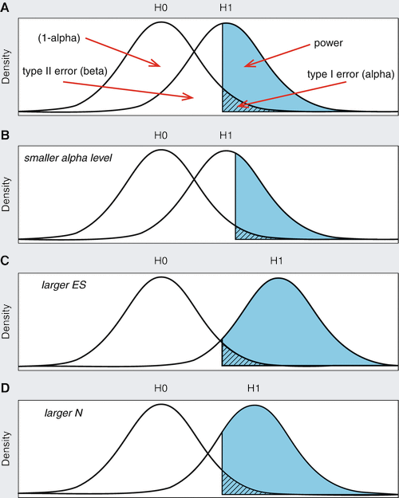

::: {.my-title}
# [Statistical Methods]{.blue}
Best & Questionable Practices

::: {.my-grey}
[ | Course ]{}<br />
[Jeffrey M. Girard | Lecture ]{}
:::

{.absolute bottom=30 right=0 width="400"}
:::

```{r setup}
#| echo: false
#| message: false

library(tidyverse)
library(easystats)
library(patchwork)
mytheme <- function(sz = 30) {
  theme_gray(base_size = sz) + 
  theme(panel.grid.minor = element_blank())
}
```

# Overview

## Research practice continuum

::: {.callout-important title="Scientific Misconduct"}
Data Fabrication, Data Falsification, (Plagiarism), (Undisclosed COIs)
:::

::: {.callout-warning title="Questionable Practices"}
Selective Reporting, *p*-hacking, HARKing, Data Peeking
:::

::: {.callout-tip title="Best Practices"}
Open Data/Materials, Preregistration, Disclosed Flexibility, Power Analysis
:::

[Ordered from least to most likely to produce true, replicable findings]{.f6}

# Bad Practices

## Scientific misconduct {.f6}

1. Must represent a "significant departure from accepted practices"
2. Must be "committed intentionally, knowingly, or recklessly"
3. Must be "proven by a preponderance of evidence"

::: {.fragment}
- **Fabrication** is making up fake data/results and presenting it as real
- **Falsification** is manipulating data/results to give a false impression
:::

::: {.fragment}
- **Plagiarism** is presenting others' ideas/results/words as your own
- **Undisclosed COIs** is failing to report relevant conflicts of interest
- **Unapproved research** is activity not approved by an ethics board
:::

## Selective reporting {.f6}

- **Cherry picking** is only including or reporting a desired subset of information (intentionally or accidentally)
    + e.g., cases, variables, studies, analyses, results, references
    + It is problematic when the subset misrepresents the whole
    + It is especially problematic when unreported (e.g., hidden)
    
::: {.fragment}
- **Selective omission** is excluding or not reporting an undesired subset of information (intentionally or accidentally)
    + This is essentially the other side of cherry picking
    
:::


## HARKing {.f6}

- "Hypothesizing after the results are known"
    + It is claiming to have predicted an unexpected result
    + Changing your hypothesis to match whatever you found
    + Going into research without any real expectations

- Why it's problematic
    + It falsely presents exploratory work as confirmatory
    + The problem is the misrepresentation (not the exploration)
    + It is more likely to capitalize on sampling error
    + "The easiest person to fool is yourself"
    
## *p*-hacking {.f6}

- Making analysis decisions to optimize **significance** instead of rigor
    + How to measure and represent variables
    + Which observations to include or exclude
    + When to stop data collection
    + Which tests and formulas to use
    + Which covariates to control for
    + How to handle assumptions and outliers
    
- If you try lots of options, a few will be significant **by chance alone**

- If you don't disclose all this trial-and-error, it is very misleading

## Data peeking {.f6}

- **Data peeking** is a form of *p*-hacking related to data collection
    + You collect some data, run analyses, and look at the *p*-value
    + If your result is significant, then you stop and publish
    + But if not, then you collect more data and try again...

- This practice capitalizes on sampling error and is biased
    + Your effect size will likely be inflated (too large)
    + A correction for this is called "sequential analysis"

- A better approach is to choose $n$ using power analysis


## Reasons for bad practices {.f6}

::: {.columns}
::: {.column}
**Perverse Incentives**

- Status and prestige
- Financial gain
- Dogmatic ideology
- Difficult to prove
:::
::: {.column}
**Human Psychology**

- Overactive pattern detection
- Misunderstanding probability
- Need for narrative and schemas
- Confirmation bias
:::
:::

:::{.pv2}
To learn more about these ideas, see [Bishop (2020)](https://doi.org/10/gg7mkb) on Canvas
:::


# Best Practices

## Open sharing {.f6}

- **Deidentified Data** (CSV) with data dictionary files
    + Many analyses can be reproduced from a covariance matrix
- **Study Materials** (surveys and stimuli) with documentation
    + Surveys can be easily exported from Qualtrics
- **Analytical Code** (Quarto HTML) with comments
    + Code to preprocess/tidy and analyze data
- **Manuscripts** (DOCX or PDF) on a preprint server
    + Pre-review versions can usually be shared


## Resources for sharing {.f6}

- [Open Science Framework (OSF)](https://osf.io) is a free website for open sharing
    + You can have public or private projects with controlled access
    + You can create anonymized links for blinded peer-review
    
- [GitHub](https://github.org) is a free website for code sharing and collaboration
    + It provides version control and free web hosting
    
- [PsyArXiV](https://psyarxiv.com) is a free preprint server for psychology manuscripts
    + Most journals allow preprint sharing ([check here](http://www.sherpa.ac.uk/romeo/journalbrowse.php))
    + Many journals allow postprint sharing (post-review version)

## Preregistration {.f6}

- Presenting exploratory work as confirmatory is misleading

- We can avoid this by "calling our shots" before data collection
    + By preregistering our hypotheses, we avoid HARKing
    + By preregistering our analyses, we avoid *p*-hacking
    + It's okay to change things, but you have to disclose it
    
- Many journals now offer **registered reports**
    + Reviewers evaluate and refine your preregistered plan
    + The journal will publish your paper if you follow the plan

# Power Analysis

## Power analysis {.f6}

::: {.columns}
::: {.column}
- **Power** is the probability of correctly rejecting the null hypothesis (given that it is false)
    + Power is closely related to<br>the effect size, $n$, and $\alpha$
    + These quantities are so related that we can estimate any one from the other three
    + **Power analysis** is doing these kind of calculations
    
:::
::: {.column .tc}
```{r, out.width="80%"}

```

:::
:::

## Types of power analysis {.f6}

- [A priori]{.b .red}: determine $n$ given others
    + Useful for planning before a new data collection (primary use)
- [Sensitivity]{.b .blue}: determine minimum $\text{ES}$ given others
    + Useful when you are unsure of the effect size to expect
- [Post-hoc]{.b .gray}: determine power $(1-\beta)$ given others
    + Not very useful in practice (since your $\text{ES}$ is based on the data)
- [Criterion]{.b .gray}: determine $\alpha$ given others
    + Not very useful in practice (since $\alpha$ is usually fixed anyway)

## Power analysis techniques

- **Analytical** power analysis
    + Solve using equations (easier but less flexible)
    + e.g., the G*Power program, the {WebPower} package

::: {.pv2}
- **Simulation**-based power analysis
    + Solve using simulated data (harder but more flexible)
    + e.g., the Mplus program, the {simr} package

:::

## *t*-test power {.f6}

- A $t$-test compares the means of two groups (independent or paired)
- To do a priori power analysis, we need an expected effect size
- The effect size that WebPower wants you to provide is Cohen's $d$

$$d=\frac{\bar{x}_2 - \bar{x}_1}{s}$$

- **Best Approach:** estimate $d$ from previous studies
- **Last Resort:** plan to detect a "small" effect $(d=0.2)$

## Example 1 {.f6}

What sample size would provide 80% power to detect an effect of size *d*=0.3 when comparing two independent groups?

```{r}
#| echo: true
#| collapse: true
#| message: false

library(WebPower)
wp.t(
  d = 0.30,
  power = 0.80,
  alpha = 0.05,
  type = "two.sample"
)
```

We would thus need 175 participants in each group (for 350 total)


## Example 2 {.f6}

Now, what sample size would provide 80% power to detect an effect of size *d*=0.5 when comparing two independent groups?

```{r}
#| echo: true
#| collapse: true
#| message: false

library(WebPower)
wp.t(
  d = 0.50,
  power = 0.80,
  alpha = 0.05,
  type = "two.sample"
)
```

We need *fewer* participants to detect a larger (more obvious) effect


## Example 3 {.f6}

Now, what sample size would provide 80% power to detect an effect of size *d*=0.5 when comparing two *dependent* groups?

```{r}
#| echo: true
#| collapse: true
#| message: false

library(WebPower)
wp.t(
  d = 0.50,
  power = 0.80,
  alpha = 0.05,
  type = "paired"
)
```

We need *fewer* participants when each provides repeated measures

## One-way ANOVA power {.f6}

- One-way ANOVA compares the means of multiple groups
- WebPower wants the $f$ effect size and $k$ (the number of groups)

$$f=\frac{\sigma_b}{\sigma_w}$$

- **Best Approach:** estimate $f$ from previous studies
- **Last Resort:** plan to detect a "small" effect $(f=0.10)$

::: {.footer}
Check out `wp.rmanova()` for repeated measured ANOVA power analysis
:::

## Example 1

What sample size would provide 80% power to detect an effect of size *f*=0.25 when comparing 4 independent groups?

```{r}
#| echo: true
#| collapse: true
#| message: false

wp.anova(
  f = 0.25,
  power = 0.80,
  alpha = 0.05,
  k = 4
)
```

We need 178 participants total (45 per group)

## Example 2 {.f6}

What sample size would provide 80% power to detect an effect of size *f*=0.25 when comparing 5 independent groups?

```{r}
#| echo: true
#| collapse: true
#| message: false

wp.anova(
  f = 0.25,
  power = 0.80,
  alpha = 0.05,
  k = 5
)
```

With more groups, we need fewer participants per group (39)


## Linear model power {.f6}

- We technically have two types of power for LM
    + Both will compare the $R^2$ values of "full" and "reduced" models
    
- **Omnibus power** (of the overall model's $F$ test)
    + Full model: Includes all predictors
    + Reduced model: Excludes all predictors
    
- **Targeted power** (of specific slopes' $t$ tests)
    + Full model: Includes all predictors
    + Reduced model: Excludes the targeted predictor(s)

## Linear model power {.f6}

- We will use the $R^2$ values to calculate the $f^2$ effect size

$$f^2=\frac{R_{\text{full}}^2 - R_{\text{reduced}}^2}{1-R_{\text{full}}^2}$$

- **Last Resort:** plan to detect a "small" effect $(f^2=.02)$

- WebPower also needs the number of predictors in each model
    + $p_1$ is the number of predictors in the full model
    + $p_2$ is the number of predictors in the reduced model

## Omnibus example 1 {.f6}

What sample size would provide 80% power to explain 10% of the variance in the outcome variable using 5 predictor variables?

- First, let's calculate $f^2$ from the specified information
    + Full model has all predictors, so $p_1=5$ and $R^2_{\text{full}}=0.10$
    + Reduced model has no predictors, so $p_2=0$ and $R^2_{\text{red}}=0.0$
    
```{r}
#| echo: true
#| collapse: true

r2_full <- 0.10
r2_red <- 0.00
f2 <- (r2_full - r2_red) / (1 - r2_full)
f2
```

## Omnibus example 1 {.f6}

Now we can calculate the sample size needed in our example

```{r}
#| echo: true
#| collapse: true
#| message: false

wp.regression(
  p1 = 5,
  p2 = 0,
  f2 = 0.111,
  alpha = 0.05,
  power = 0.80
)
```

We would need around 121 total participants

## Omnibus example 2 {.f6}

Now, what sample size would provide 80% power to explain 10% of the variance in the outcome variable using 7 predictor variables?

- First, let's calculate $f^2$ from the specified information
    + Full model has all predictors, so $p_1=7$ and $R^2_{\text{full}}=0.10$
    + Reduced model has no predictors, so $p_2=0$ and $R^2_{\text{red}}=0.0$
    
```{r}
#| echo: true
#| collapse: true

r2_full <- 0.10
r2_red <- 0.00
f2 <- (r2_full - r2_red) / (1 - r2_full)
f2
```

## Omnibus example 2 {.f6}

Now we can calculate the sample size needed in our example

```{r}
#| echo: true
#| collapse: true
#| message: false

wp.regression(
  p1 = 7,
  p2 = 0,
  f2 = 0.111,
  alpha = 0.05,
  power = 0.80
)
```

We need a larger sample with more predictors (but the same $f^2$)

## Targeted example 1 {.f6}

If sex and age explain 20% of the variance in our outcome variable, what sample size would provide 80% power to detect the effect of a third predictor that explains an additional 5%?

- Full model has three predictors, so $p_1=3$ and $R^2_{\text{full}}=0.25$
- Reduced model has two predictors, so $p_2=2$ and $R^2_{\text{red}}=0.20$
    
```{r}
#| echo: true
#| collapse: true

r2_full <- 0.25
r2_red <- 0.20
f2 <- (r2_full - r2_red) / (1 - r2_full)
f2
```

## Targeted example 1 {.f6}

Now we can calculate the sample size needed in our example

```{r}
#| echo: true
#| collapse: true
#| message: false

wp.regression(
  p1 = 3,
  p2 = 2,
  f2 = 0.067,
  alpha = 0.05,
  power = 0.80
)
```

We need around 119 total participants


## Targeted example 2 {.f6}

In the same example as the last one, what would change if sex and age had explained 40% of the variance instead of only 20%?

- Full model has three predictors, so $p_1=3$ and $R^2_{\text{full}}=0.45$
- Reduced model has two predictors, so $p_2=2$ and $R^2_{\text{red}}=0.40$
    
```{r}
#| echo: true
#| collapse: true

r2_full <- 0.45
r2_red <- 0.40
f2 <- (r2_full - r2_red) / (1 - r2_full)
f2
```

## Targeted example 2 {.f6}

Now we can calculate the sample size needed in our example

```{r}
#| echo: true
#| collapse: true
#| message: false

wp.regression(
  p1 = 3,
  p2 = 2,
  f2 = 0.091,
  alpha = 0.05,
  power = 0.80
)
```

With more total variance explained, we need fewer participants
